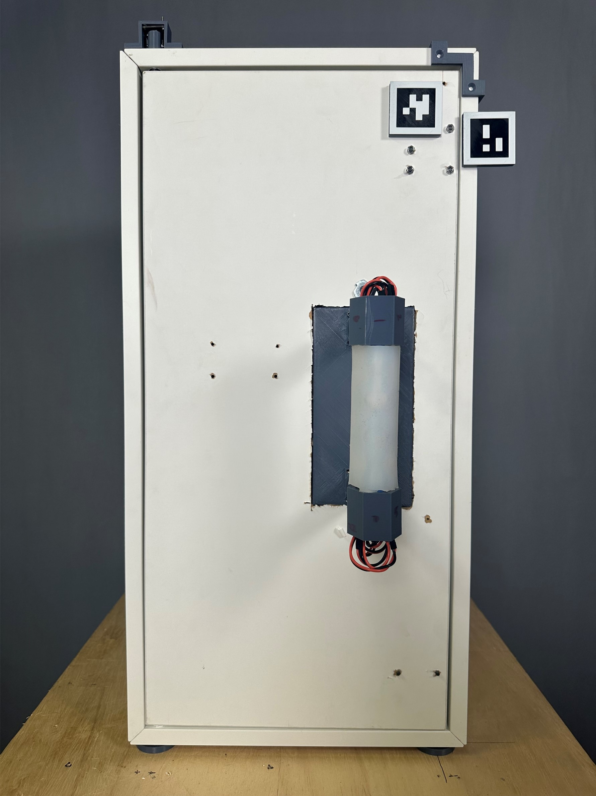
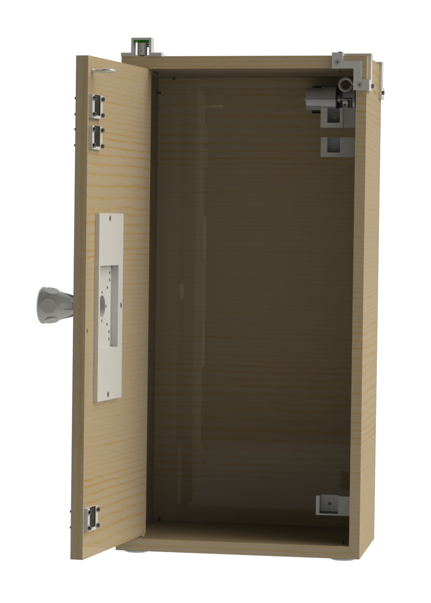

# Door Reset Mechanism

The Door Reset Mechanism (DORM) resets a cabinet to its closed position. It also uses electromagnets to provide a variable resistance to opening, integrates orientation and force sensors. 

The following sections will provide detailed documentation about the mechanism and its software.

---

## CAD

A complete CAD assembly (Solidworks 2023) and bill of materials (Excel) of the mechanism [are available at this link](https://oregonstate.box.com/s/5hvh5zr6w84fwhshscfek9fnh1xklzux), and embedded below. 

<iframe src="https://oregonstate.app.box.com/embed/s/5hvh5zr6w84fwhshscfek9fnh1xklzux?sortColumn=date" width="700" height="500" frameborder="0" allowfullscreen webkitallowfullscreen msallowfullscreen></iframe>

## Electrical

Schematics and Gerber PCB files [are available here.](https://oregonstate.box.com/s/ys0l9vg5lmcvihlmls1g7xryc1gnctif)

<iframe src="https://oregonstate.app.box.com/embed/s/ys0l9vg5lmcvihlmls1g7xryc1gnctif?sortColumn=date" width="700" height="500" frameborder="0" allowfullscreen webkitallowfullscreen msallowfullscreen></iframe>