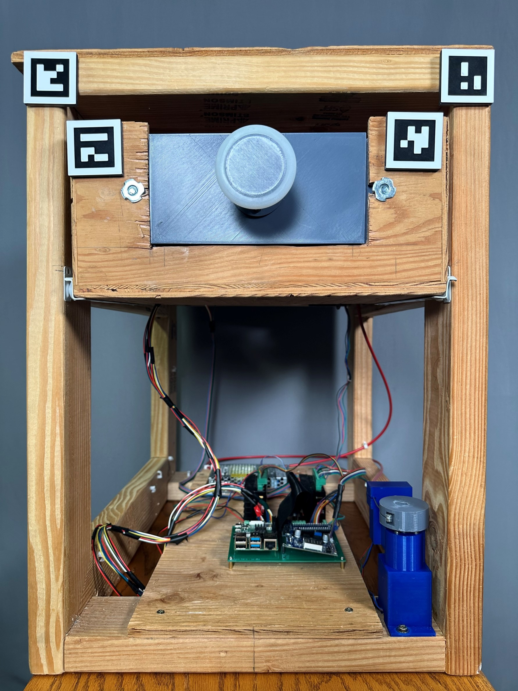

# Drawer Reset Mechanism

The Drawer Reset Mechanism (DWRM) resets a drawer to its closed position. It also uses a mechanical brake to provide a variable resistance to opening, integrates position and force sensors. 

The following sections will provide detailed documentaion about the mechanism and its software.

---

## CAD
> **_NOTE:_**  Full rendering with be added here shortly.

A complete CAD assembly (Solidworks 2023) and bill of materials (Excel) of the mechanism [are avaliable at this link](https://oregonstate.box.com/s/5hvh5zr6w84fwhshscfek9fnh1xklzux), and embeded below. 

<iframe src="https://oregonstate.app.box.com/embed/s/5hvh5zr6w84fwhshscfek9fnh1xklzux?sortColumn=date" width="700" height="500" frameborder="0" allowfullscreen webkitallowfullscreen msallowfullscreen></iframe>

## Electrical

Schematics and Gerber PCB files [are avaliable here.](https://oregonstate.box.com/s/rgpnydxxyj3els1m5ogiqaizsvxpcfnn)

<iframe src="https://oregonstate.app.box.com/embed/s/rgpnydxxyj3els1m5ogiqaizsvxpcfnn?sortColumn=date" width="700" height="500" frameborder="0" allowfullscreen webkitallowfullscreen msallowfullscreen></iframe>
