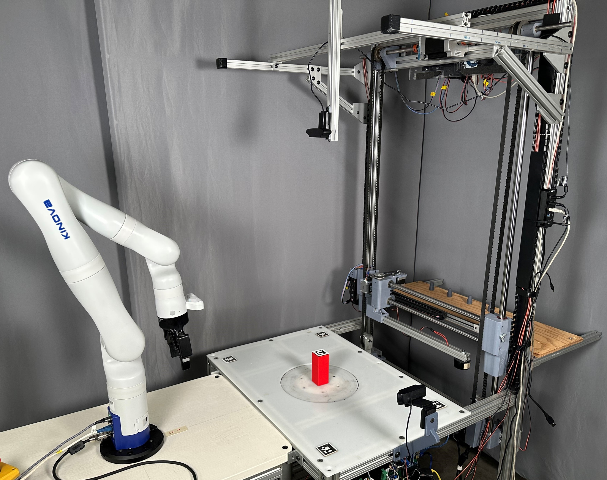

# Grasp Reset Mechanism

The Grasp Reset Mechanism (GRM) resets an object to a home position and a variable orientation. It also swaps between objects, collects data, and interfaces with a variety of manipulators. The GRM was designed to enable large scale grasping trials --- whether for benchmarking, testing, training learning models, or generating datasets.

The following sections will provide detailed documentaion about the mechanism and its software.

---

## CAD
> **_NOTE:_**  Full rendering with be added here shortly.

A complete CAD assembly (Solidworks 2023) and bill of materials (Excel) of the mechanism [are avaliable at this link](https://oregonstate.box.com/s/0rofl8td2ilchw8jbm8t5b4i4tjxo42b), and embeded below. 

<iframe src="https://oregonstate.app.box.com/embed/s/0rofl8td2ilchw8jbm8t5b4i4tjxo42b?sortColumn=date" width="700" height="500" frameborder="0" allowfullscreen webkitallowfullscreen msallowfullscreen></iframe>

## Electrical

Schematics for the entire mechanism, and Gerber PCB files [are avaliable here.](https://oregonstate.box.com/s/2b1ixlblip1riod3xyzncki3v4kpd1u8)

<iframe src="https://oregonstate.app.box.com/embed/s/2b1ixlblip1riod3xyzncki3v4kpd1u8?sortColumn=date" width="700" height="500" frameborder="0" allowfullscreen webkitallowfullscreen msallowfullscreen></iframe>

